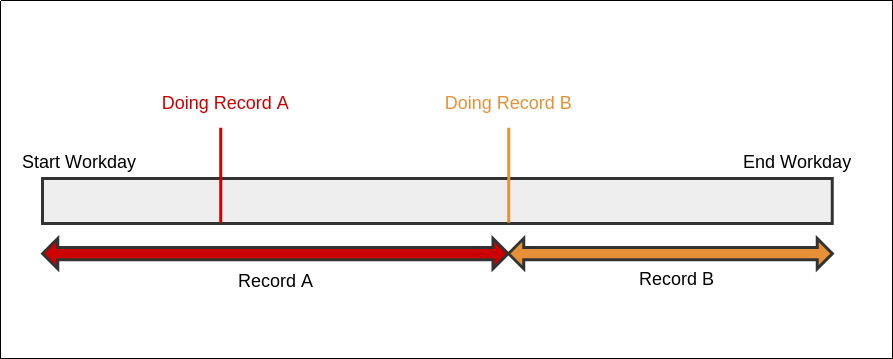

# Doing (WIP)

> An tool for keeping track of what I've been doing

## What

* Keeps track of when your computer was turned on and off.
* Can run a webserver with a calendar view.
* Makes you look busier than you actually are.
* Treats words prefixed with `@` as tags.
* Tab completes existing tags.



## UI

Entering Records:

``` sh
$ doing <description>
$ doing @app refactoring Foo controller
$ doing listening to @dubstep on @youtube
$ doing nothing
```

Starting Web Interface:

``` sh
$ doing --web
```

Updating Workday:

``` sh
$ doing --ping
```

List Tags (used by tab completion script):

``` sh
$ doing --tags
```

## How

* A single entry is called a `Record`.
* A startup and shutdown cycle is called a `Workday`.
* A cron job periodically calls `doing --ping` to update the `Workday`.
* Storage will be implemented using flat files.

## Storage

A simple file structure.

```
doing/
  tags
  lock
  records/
    <year>/
      <month>/
        <workday>
```

* `tags` file will be a text file with each tag on its own line.
* `workday` files will be json with the following format.
* `lock` file is a global pid lockfile.

``` json
{
  "start": "2015-02-05T10:01:50-05:00",
  "end": "2015-02-05T10:01:50-05:00",
  "records": [
    {
      "time": "2015-02-05T10:01:50-05:00",
      "description": "<description>",
      "tags": ["<tag>", "<tag>"]
    }
  ]
}
```
